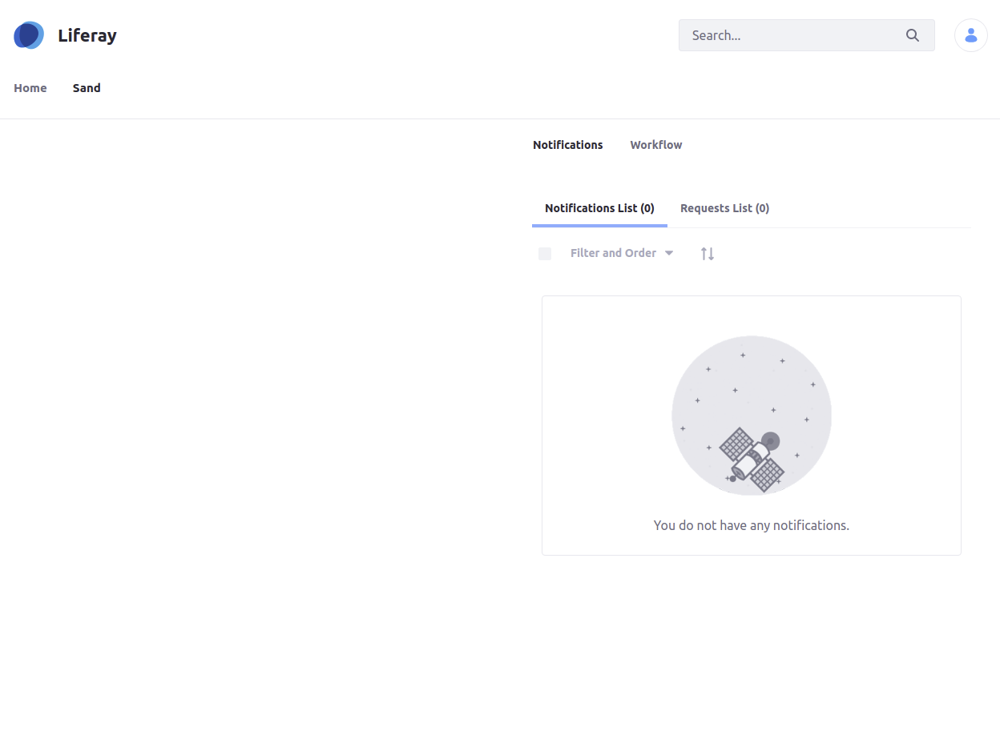

# notifications-workflow-wrapper

Just a simple portlet that does not a lot other than wrapping the notifications and workflow portlets in a tabbed view so they can be used in sites

Developed to run on the following versions of Liferay and/or Commerce: `Liferay DXP 7.3`

Built with [Liferay Workspace](https://help.liferay.com/hc/en-us/articles/360029147471-Liferay-Workspace) and [Blade CLI](https://help.liferay.com/hc/en-us/articles/360029147071-Blade-CLI).




## How to Build and Deploy to Liferay

Follow the steps below to build and deploy or copy the modules from the [releases](../../../releases/latest) page to your Liferay's deploy folder.

In order to build or deploy this module you will need to [install Blade CLI](https://help.liferay.com/hc/en-us/articles/360028833852-Installing-Blade-CLI).

### To Build

`$ blade gw build`

You can find the built modules at `modules/{module-name}/build/libs/{module-name}.jar`.

### To Deploy

In `gradle-local.properties` add the following line to point towards the Liferay instance you want to deploy to:
```
liferay.workspace.home.dir=/path/to/liferay/home
```

`$ blade gw deploy`

## Usage

[Adding Widgets to a Page.](https://learn.liferay.com/dxp/7.x/en/site-building/creating-pages/using-widget-pages/adding-widgets-to-a-page.html)

*Explain what's required to set up and make use of all of the projects features.*

### Features

* Feature One
    * One.One

## Issues & Questions Welcome